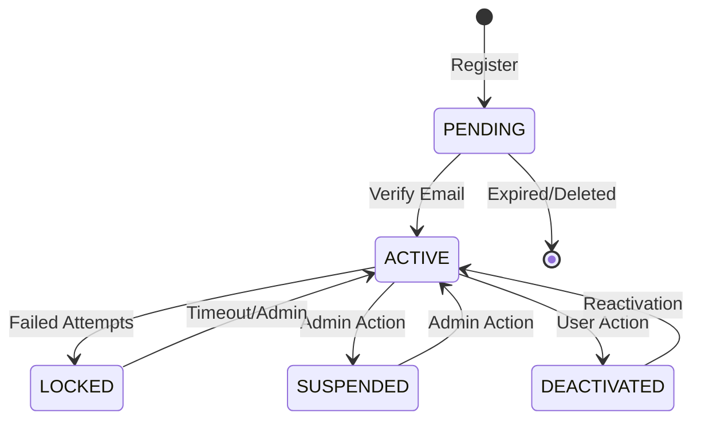
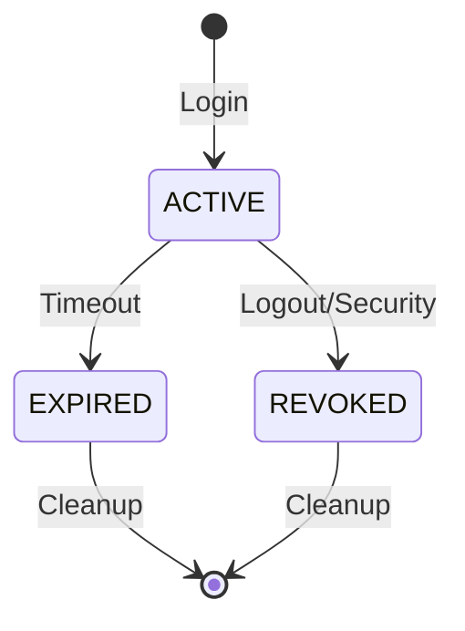

# Authentication Domain Model - The Last Frontier

## 1. Core Entities

### 1.1 User Entity
```typescript
interface User {
  id: string;                    // UUID primary key
  email: string;                 // Unique email address
  emailVerified: boolean;        // Email verification status
  passwordHash: string;          // bcrypt hashed password
  role: UserRole;               // EXPLORER | PROFESSIONAL | ENTERPRISE | ADMIN
  profile: UserProfile;         // User profile information
  twoFactorEnabled: boolean;    // 2FA activation status
  twoFactorSecret?: string;     // TOTP secret (encrypted)
  backupCodes: string[];        // Recovery codes (hashed)
  accountStatus: AccountStatus; // ACTIVE | LOCKED | SUSPENDED | PENDING
  passwordResetToken?: string;  // Temporary reset token
  passwordResetExpiry?: Date;   // Reset token expiration
  emailVerificationToken?: string; // Email verification token
  emailVerificationExpiry?: Date;  // Verification token expiration
  lastLoginAt?: Date;           // Last successful login
  loginAttempts: number;        // Failed login attempt counter
  lockedUntil?: Date;          // Account lockout expiration
  createdAt: Date;             // Account creation timestamp
  updatedAt: Date;             // Last modification timestamp
}
```

### 1.2 UserProfile Entity
```typescript
interface UserProfile {
  firstName?: string;          // User's first name
  lastName?: string;           // User's last name
  displayName?: string;        // Preferred display name
  avatarUrl?: string;          // Profile picture URL
  timezone?: string;           // User's timezone
  locale?: string;             // Preferred language/locale
  company?: string;            // Company/organization
  jobTitle?: string;           // Professional title
  bio?: string;                // User biography
  website?: string;            // Personal/company website
  linkedinUrl?: string;        // LinkedIn profile
  githubUrl?: string;          // GitHub profile
}
```

### 1.3 UserSession Entity
```typescript
interface UserSession {
  id: string;                  // Session UUID
  userId: string;              // Reference to User
  accessToken: string;         // JWT access token
  refreshToken: string;        // JWT refresh token
  deviceInfo: DeviceInfo;      // Device identification
  ipAddress: string;           // Client IP address
  userAgent: string;           // Browser/client info
  isActive: boolean;           // Session status
  lastAccessedAt: Date;        // Last activity timestamp
  expiresAt: Date;             // Session expiration
  createdAt: Date;             // Session creation
}
```

### 1.4 DeviceInfo Entity
```typescript
interface DeviceInfo {
  deviceId: string;            // Unique device identifier
  deviceName?: string;         // Human-readable device name
  deviceType: DeviceType;      // DESKTOP | MOBILE | TABLET | API
  platform?: string;          // Operating system
  browser?: string;            // Browser name
  version?: string;            // Browser/app version
  isTrasted: boolean;          // Trusted device flag
}
```

### 1.5 OAuth Account Entity
```typescript
interface OAuthAccount {
  id: string;                  // OAuth account UUID
  userId: string;              // Reference to User
  provider: OAuthProvider;     // GOOGLE | GITHUB | LINKEDIN
  providerAccountId: string;   // Provider's user ID
  providerEmail: string;       // Email from provider
  accessToken?: string;        // Provider access token (encrypted)
  refreshToken?: string;       // Provider refresh token (encrypted)
  expiresAt?: Date;           // Token expiration
  scope?: string;             // Granted permissions
  tokenType?: string;         // Token type (Bearer, etc.)
  createdAt: Date;            // Link creation timestamp
  updatedAt: Date;            // Last token refresh
}
```

### 1.6 AuditLog Entity
```typescript
interface AuditLog {
  id: string;                  // Log entry UUID
  userId?: string;             // Reference to User (if applicable)
  action: AuditAction;         // Specific action performed
  resource: string;            // Resource affected
  details: Record<string, any>; // Additional context data
  ipAddress: string;           // Client IP address
  userAgent: string;           // Client information
  success: boolean;            // Operation outcome
  errorMessage?: string;       // Error details if failed
  timestamp: Date;             // Event timestamp
}
```

### 1.7 RateLimitEntry Entity
```typescript
interface RateLimitEntry {
  id: string;                  // Rate limit entry UUID
  identifier: string;          // IP address or user ID
  endpoint: string;            // API endpoint
  attempts: number;            // Current attempt count
  windowStart: Date;           // Rate limit window start
  windowEnd: Date;             // Rate limit window end
  isBlocked: boolean;          // Blocked status
}
```

## 2. Enumerations

### 2.1 User Role Enumeration
```typescript
enum UserRole {
  EXPLORER = 'explorer',       // Basic tier with limited features
  PROFESSIONAL = 'professional', // Enhanced features for professionals
  ENTERPRISE = 'enterprise',   // Full access with team management
  ADMIN = 'admin'              // System administration privileges
}
```

### 2.2 Account Status Enumeration
```typescript
enum AccountStatus {
  PENDING = 'pending',         // Email verification pending
  ACTIVE = 'active',           // Account active and verified
  LOCKED = 'locked',           // Temporarily locked due to failed attempts
  SUSPENDED = 'suspended',     // Administratively suspended
  DEACTIVATED = 'deactivated'  // User-initiated deactivation
}
```

### 2.3 OAuth Provider Enumeration
```typescript
enum OAuthProvider {
  GOOGLE = 'google',           // Google OAuth2
  GITHUB = 'github',           // GitHub OAuth2
  LINKEDIN = 'linkedin'        // LinkedIn OAuth2
}
```

### 2.4 Device Type Enumeration
```typescript
enum DeviceType {
  DESKTOP = 'desktop',         // Desktop computer
  MOBILE = 'mobile',           // Mobile phone
  TABLET = 'tablet',           // Tablet device
  API = 'api'                  // API client/service
}
```

### 2.5 Audit Action Enumeration
```typescript
enum AuditAction {
  // Authentication Events
  LOGIN_SUCCESS = 'login_success',
  LOGIN_FAILURE = 'login_failure',
  LOGOUT = 'logout',
  TOKEN_REFRESH = 'token_refresh',
  
  // Registration Events
  REGISTRATION = 'registration',
  EMAIL_VERIFICATION = 'email_verification',
  EMAIL_VERIFICATION_RESEND = 'email_verification_resend',
  
  // Password Events
  PASSWORD_CHANGE = 'password_change',
  PASSWORD_RESET_REQUEST = 'password_reset_request',
  PASSWORD_RESET_COMPLETE = 'password_reset_complete',
  
  // 2FA Events
  TWO_FACTOR_ENABLED = 'two_factor_enabled',
  TWO_FACTOR_DISABLED = 'two_factor_disabled',
  TWO_FACTOR_VERIFIED = 'two_factor_verified',
  BACKUP_CODES_GENERATED = 'backup_codes_generated',
  
  // OAuth Events
  OAUTH_LINK = 'oauth_link',
  OAUTH_UNLINK = 'oauth_unlink',
  OAUTH_LOGIN = 'oauth_login',
  
  // Account Events
  ACCOUNT_LOCKED = 'account_locked',
  ACCOUNT_UNLOCKED = 'account_unlocked',
  ACCOUNT_SUSPENDED = 'account_suspended',
  ACCOUNT_REACTIVATED = 'account_reactivated',
  
  // Security Events
  SUSPICIOUS_ACTIVITY = 'suspicious_activity',
  RATE_LIMIT_EXCEEDED = 'rate_limit_exceeded',
  SECURITY_VIOLATION = 'security_violation'
}
```

## 3. Domain Relationships

### 3.1 User Relationships
- **User → UserProfile**: One-to-One (embedded/owned)
- **User → UserSession**: One-to-Many (sessions belong to user)
- **User → OAuthAccount**: One-to-Many (multiple OAuth providers)
- **User → AuditLog**: One-to-Many (audit trail for user actions)

### 3.2 Session Relationships
- **UserSession → User**: Many-to-One (session belongs to user)
- **UserSession → DeviceInfo**: One-to-One (embedded device info)

### 3.3 OAuth Relationships
- **OAuthAccount → User**: Many-to-One (OAuth account linked to user)

### 3.4 Audit Relationships
- **AuditLog → User**: Many-to-One (optional, some logs may not have user)

## 4. Business Rules and Invariants

### 4.1 User Account Rules
- **R001**: Email addresses must be unique across the system
- **R002**: Password must meet strength requirements (REQ-004)
- **R003**: Email verification required before account activation
- **R004**: Account locked after 5 consecutive failed login attempts
- **R005**: Locked accounts automatically unlock after 15 minutes
- **R006**: Enterprise users must enable 2FA within 30 days
- **R007**: Password history enforced (last 5 passwords)

### 4.2 Session Management Rules
- **R008**: Access tokens expire after 1 hour
- **R009**: Refresh tokens expire after 30 days (90 days with "remember me")
- **R010**: Maximum 5 concurrent sessions per user
- **R011**: Sessions invalidated on password change
- **R012**: Suspicious activity triggers session revocation

### 4.3 Two-Factor Authentication Rules
- **R013**: TOTP secrets must be cryptographically secure
- **R014**: Backup codes are single-use only
- **R015**: 10 backup codes generated per user
- **R016**: 2FA required for Enterprise tier users
- **R017**: 2FA setup requires current password verification

### 4.4 OAuth Integration Rules
- **R018**: One OAuth account per provider per user
- **R019**: OAuth email must match or be verified
- **R020**: OAuth accounts can be linked to existing users
- **R021**: Unlinked OAuth accounts maintain audit trail

### 4.5 Rate Limiting Rules
- **R022**: 5 login attempts per 15 minutes per IP
- **R023**: 3 email verification resends per hour per user
- **R024**: 1 password reset request per 5 minutes per email
- **R025**: 100 API requests per minute per authenticated user

## 5. State Transitions

### 5.1 User Account States


### 5.2 Session States


## 6. Validation Rules

### 6.1 Email Validation
- Format: RFC 5322 compliant email address
- Length: Maximum 254 characters
- Uniqueness: Case-insensitive unique constraint
- Blacklist: Common disposable email providers (configurable)

### 6.2 Password Validation
- Minimum: 8 characters
- Maximum: 128 characters
- Required: Uppercase, lowercase, number, special character
- Forbidden: Common passwords, dictionary words, user info
- History: Cannot reuse last 5 passwords

### 6.3 Token Validation
- Format: UUID v4 for all tokens
- Entropy: Cryptographically secure random generation
- Expiration: All tokens must have expiration times
- Single-use: Email verification and backup codes

## 7. Events and Event Flow

### 7.1 Registration Flow Events
```typescript
interface RegistrationEvents {
  UserRegistrationStarted: {
    email: string;
    role: UserRole;
    timestamp: Date;
  };
  
  UserRegistrationCompleted: {
    userId: string;
    email: string;
    role: UserRole;
    timestamp: Date;
  };
  
  EmailVerificationRequested: {
    userId: string;
    email: string;
    token: string;
    expiresAt: Date;
    timestamp: Date;
  };
  
  EmailVerified: {
    userId: string;
    email: string;
    timestamp: Date;
  };
}
```

### 7.2 Authentication Flow Events
```typescript
interface AuthenticationEvents {
  LoginAttempted: {
    email: string;
    ipAddress: string;
    userAgent: string;
    timestamp: Date;
  };
  
  LoginSucceeded: {
    userId: string;
    sessionId: string;
    deviceInfo: DeviceInfo;
    timestamp: Date;
  };
  
  LoginFailed: {
    email: string;
    reason: string;
    attempts: number;
    ipAddress: string;
    timestamp: Date;
  };
  
  AccountLocked: {
    userId: string;
    email: string;
    lockedUntil: Date;
    reason: string;
    timestamp: Date;
  };
}
```

### 7.3 Security Events
```typescript
interface SecurityEvents {
  TwoFactorEnabled: {
    userId: string;
    method: string;
    timestamp: Date;
  };
  
  SuspiciousActivityDetected: {
    userId?: string;
    ipAddress: string;
    activity: string;
    riskScore: number;
    timestamp: Date;
  };
  
  PasswordChanged: {
    userId: string;
    triggeredBy: 'user' | 'admin' | 'reset';
    timestamp: Date;
  };
}
```

## 8. Data Access Patterns

### 8.1 Query Patterns
- **User Lookup**: By email, by ID, by OAuth provider
- **Session Management**: Active sessions by user, session by token
- **Audit Queries**: By user, by time range, by action type
- **Security Queries**: Failed attempts by IP, locked accounts

### 8.2 Command Patterns
- **User Commands**: Create, update profile, change password, lock/unlock
- **Session Commands**: Create, refresh, revoke, cleanup expired
- **Audit Commands**: Log event, batch insert for high-volume events

### 8.3 Performance Considerations
- **Indexing**: Email (unique), session tokens, audit logs by timestamp
- **Caching**: User sessions, rate limit counters, OAuth provider configs
- **Partitioning**: Audit logs by date, rate limit entries by time window

## 9. Integration Boundaries

### 9.1 Authentication Service Boundary
- **Owns**: User accounts, sessions, 2FA setup
- **Publishes**: Authentication events, security alerts
- **Consumes**: Email service, OAuth provider APIs

### 9.2 External Service Dependencies
- **Email Service**: Verification emails, password reset notifications
- **OAuth Providers**: User profile data, authentication delegation
- **Monitoring Service**: Security alerts, performance metrics
- **Rate Limiting Service**: Request counting, blocking decisions

---

**Document Version**: 1.0  
**Last Updated**: 2025-01-30  
**Next Phase**: Phase 3 - Pseudocode Design